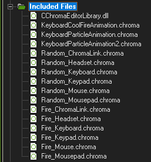
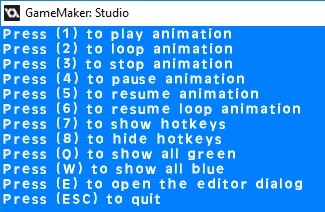

# Before you start!

* This is NOT an official extension by Razer; this is a fork I made to bring it up to speed, since the official is built for the long-dead GM:S 1.4, which is basically impractical to use for making actual games nowadays.

* The original can be found [HERE](https://github.com/razerofficial/GameMakerChromaExtension).

* Also, **THIS REPOSITORY IS A SIDE PROJECT OF MINE, AND IS NOT A PRIORITY TO UPDATE ATM**.
   * I originally updated this for my own personal use, but I thought there might be someone interested in putting Razer support in their own GameMaker project. The system I made for my own game is modular enough to simply tear out a copy and put it in another project, so I thought I'd put it here. It's a bit of a fixer-upper, but I'm going to work on that. :P

* This extension now relies on a seperate object to help it run properly, fittingly named `RGBCHROMA`.
   * I've made it so everything in this project shouldn't interfere with your own project when imported; you can import the package into your own project and it'll be nice and organized. All you have to do is follow the set-up instructions and it should work!

* You're welcome to mess around with anything here, by the way. I just thought this was the simplest way to add basic RGB support.

# Artyrian's Expanded GameMaker Razer Chroma Support - Razer Chroma control for GameMaker 2022+

**Table of Contents**

* [See Also](#see-also)
* [Platforms Required](#frameworks-supported)
* [Getting Started](#getting-started)
* [What's Included?](#assets)
* [Custom Wrappers](#wrappers)
* [API](#api)
* [Examples](#examples)

<a name="related"></a>
## See Also

**Docs:**

- [Chroma Animation Guide](http://chroma.razer.com/ChromaGuide/) - Visual examples of the Chroma Animation API methods.

**Plugins:**

- [CChromaEditor](https://github.com/RazerOfficial/CChromaEditor) - C++ native MFC library for playing and editing Chroma animations.

<a name="frameworks-supported"></a>
## Platforms Required
- This extension is meant for GameMaker 2022+.
  - This works as of GameMaker Runtime 2024.4.0.168, the version I currently use in my own projects.
  - While I DID originally create this system back in the GMS 2.3+ era, **I cannot guarantee it will still work in 2.3+**.
- Razer Chroma only runs on the __Windows__ platform. Keep this in mind when exporting to other platforms.
  - A good rule of thumb is to go into the "Included Files" tab of your project and make sure the files only copy to the Windows platform.

<a name="getting-started"></a>
## Getting Started

* If you haven't already, go install [Synapse](https://www.razer.com/synapse-3). This is **REQUIRED** for this to even work in the first place!

* Make sure the Chroma Connect module is installed.


* NOTE: If you don't have Chroma hardware, you can see Chroma effects with the [Chroma Emulator](https://github.com/razerofficial/ChromaEmulator)

1. Import the [RazerChromaGameMakerSupport.yymps](hhttps://github.com/TheArtyrian/ExpandedGamemakerChroma/releases) extension by dragging it into the GameMaker window. A window should pop up.
   * Make sure you have the project you want open; adding this on the main menu will simply make a new project.


2. Be sure to click "Add All". This will add all of the things that you'll need to run Razer Chroma.

3. You should now have imported everything into your project! Don't worry about clutter; everything is in dedicated folders named "-- RAZER CHROMA --" in the Objects and Scripts folders.


4. Now, to use RGB in the game, you should put it in the starting room of your project. It will remain there for the entirety of your game being open.

<a name="assets"></a>
## What's Included?

- In your included files, you should find:
  - The `ChromaAppInfo.xml` file. This tells Synapse the information about your game. You can fill out this info using a text editor (cough cough use Notepad++ cough cough).
  - The `CChromaEditorLibrary.dll` file, renamed to `ChromaEngine.dll` as to kinda hint that file should NOT be deleted. Which it shouldn't. It's also the editor for Razer Chroma files, as the original name implies.
  - A few custom patterns I made to help you out, as well as ones with a `blank_` prefix. These are used to blank all Chroma devices at the start - without these, Chroma devices will simply freeze on the last animation they were playing prior to your application's launch.
      - Should you want to remove these, see `RGB_MACROS` in the scripts folder (-- RAZER CHROMA -- > Custom Wrapping).
      - That said, it'd be wise not to remove any files with the `blank_` prefix, as these are necessary for proper function of this system.
 
- When adding/removing custom Chroma files (including the ones I made), refer to the `RGB_MACROS` script. That's where you can define the macros that will be used to make Chroma run on the custom wrappers I made.



<a name="wrappers"></a>
## Custom Wrappers

To make working with Chroma patterns easier, I've created a few GameMaker functions to wrap the raw API functions into something a lot more user-friendly!

* [RGB_MACROS](#Wrapper_RGBMACROS)
* [chroma_toggle](#Wrapper_CHROMATOGGLE)
* [chroma_set_all](#Wrapper_CHROMASETALL)
* [chroma_set_all_loop](#Wrapper_CHROMASETALLLOOP)
* [chroma_set_anim](#Wrapper_CHROMASETANIM)
* [chroma_set_anim_loop](#Wrapper_CHROMASETANIMLOOP)
* [key_to_rgbkey](#Wrapper_KEYTORGBKEY)

Please note these functions only work on `Windows` platforms. The plugin will automatically detect the platform and throw an error message in GameMaker's `Output` window if the OS isn't correct.

<a name="Wrapper_RGBMACROS"></a>
**RGB_MACROS**

This contains crucial information for the plugin to work properly, including `RZKEY` macros and basic color IDs for simple key coloring (`RZCOLOR`).
**__When adding new `.chroma` files to your project, use this file to define a macro with their location in Included Files.__**

(Nerd Time: In the original version of this plugin by Razer, all Global data - including `RZKEY` info - was stored in GameMaker's `global.` variable system. With Macros, however, this is no longer necessary, reducing a lot of clutter.)

<a name="Wrapper_CHROMATOGGLE"></a>
**chroma_toggle**

<a name="Wrapper_CHROMASETALL"></a>
**chroma_set_all**

<a name="Wrapper_CHROMASETALLLOOP"></a>
**chroma_set_all_loop**

<a name="Wrapper_CHROMASETANIM"></a>
**chroma_set_anim**

<a name="Wrapper_CHROMASETANIMLOOP"></a>
**chroma_set_anim_loop**

<a name="Wrapper_KEYTORGBKEY"></a>
**key_to_rgbkey**

Converts a GameMaker key value (either from `vk_` constants or `ord()`) to its respective `RZKEY`. Useful for changing what key lights up, should you have remappable controls.

<a name="api"></a>
## API

The custom wrapper functions utilize the scripts below. There's not necessarily a reason to worry about these, but if the wrappers don't completely suit your needs, you can use these functions directly.

* [ScriptChromaCloseAnimationName](#ScriptChromaCloseAnimationName)
* [ScriptChromaCloseComposite](#ScriptChromaCloseComposite)
* [ScriptChromaCopyKeyColorName](#ScriptChromaCopyKeyColorName)
* [ScriptChromaGet1DColorName](#ScriptChromaGet1DColorName)
* [ScriptChromaGet2DColorName](#ScriptChromaGet2DColorName)
* [ScriptChromaGetCurrentFrameName](#ScriptChromaGetCurrentFrameName)
* [ScriptChromaGetDeviceName](#ScriptChromaGetDeviceName)
* [ScriptChromaGetDeviceTypeName](#ScriptChromaGetDeviceTypeName)
* [ScriptChromaGetFrameCountName](#ScriptChromaGetFrameCountName)
* [ScriptChromaGetKeyColorName](#ScriptChromaGetKeyColorName)
* [ScriptChromaGetMaxColumn](#ScriptChromaGetMaxColumn)
* [ScriptChromaGetMaxLeds](#ScriptChromaGetMaxLeds)
* [ScriptChromaGetMaxRow](#ScriptChromaGetMaxRow)
* [ScriptChromaInit](#ScriptChromaInit)
* [ScriptChromaOpenEditorDialog](#ScriptChromaOpenEditorDialog)
* [ScriptChromaPauseAnimationName](#ScriptChromaPauseAnimationName)
* [ScriptChromaPlayAnimationName](#ScriptChromaPlayAnimationName)
* [ScriptChromaPlayAnimationFrameName](#ScriptChromaPlayAnimationFrameName)
* [ScriptChromaPlayComposite](#ScriptChromaPlayComposite)
* [ScriptChromaResumeAnimationName](#ScriptChromaResumeAnimationName)
* [ScriptChromaSet1DColorName](#ScriptChromaSet1DColorName)
* [ScriptChromaSet2DColorName](#ScriptChromaSet2DColorName)
* [ScriptChromaSetCurrentFrameName](#ScriptChromaSetCurrentFrameName)
* [ScriptChromaSetKeyColorName](#ScriptChromaSetKeyColorName)
* [ScriptChromaStopComposite](#ScriptChromaStopComposite)
* [ScriptChromaUninit](#ScriptChromaUninit)


**NOTE:** As with the entire system itself, these functions are only available on the `Windows` platform. Use `GML` to detect the `os_type` for `os_windows` before actually executing script!

```
if (os_type == os_windows)
{
   // do Chroma
}
```

When the first room loads, run GMS script to set the default global variables. These globals are what connects the `Chroma` DLL methods.

See [ScriptGlobals.gml](scripts/ScriptGlobals.gml).

The API has various methods with the `D` suffix where `double` return-type/parameters were used. This is to support engines like `GameMaker` which have a limited number of data-types.


<a name="ScriptChromaCloseAnimationName"></a>
**ScriptChromaCloseAnimationName**

The helper script closes an animation to reload from disk. The method takes a string parameter of the animation name.

```
animation = 'Random_Keyboard.chroma';
ScriptChromaCloseAnimationName(animation);
```


<a name="ScriptChromaCopyKeyColorName"></a>
**ScriptChromaCopyKeyColorName**

The helper script copies the key color from a source animation to the target animation for the key of the animation frame. The source and target animation are strings. The frame index is a number from 0 to the frame count. The key is a integer of the key number.

See [ScriptGlobals.gml](scripts/ScriptGlobals.gml) for the list of key values.

```
sourceAnimation = 'Fire_Keyboard.chroma';
targetAnimation = 'Random_Keyboard.chroma';
frameIndex = 0;
key = gloval.RZKEY_W;
ScriptChromaCopyKeyColorName(sourceAnimation, targetAnimation, frameIndex, key);
```


<a name="ScriptChromaGetFrameCountName"></a>
**ScriptChromaGetFrameCountName**

The helper script returns the number of animation frames. The animation parameter is a string.

```
animation = 'Random_Keyboard.chroma';
frameCount = ScriptChromaGetFrameCountName(animation);
```


<a name="ScriptChromaInit"></a>
**ScriptChromaInit**

The helper script initializes the `ChromaSDK` and has no parameters.

```
ScriptChromaInit();
```


<a name="ScriptChromaOpenEditorDialog"></a>
**ScriptChromaOpenEditorDialog**

The helper script opens an edit dialog for the animation. The animation parameter is a string. The edit dialog is modal so only one animation can be edited at a time.

```
animation = 'Random_Keyboard.chroma';
ScriptChromaOpenEditorDialog(animation);
```


<a name="ScriptChromaPauseAnimationName"></a>
**ScriptChromaPauseAnimationName**

The helper script pauses an animation. The animation parameter is a string.

```
animation = 'Random_Keyboard.chroma';
ScriptChromaPauseAnimationName(animation);
```


<a name="ScriptChromaPlayAnimationName"></a>
**ScriptChromaPlayAnimationName**

The helper script plays an animation. The animation parameter is a string. The animation can play with loop `ON` or `OFF`.

```
animation = 'Random_Keyboard.chroma';
loopOn = 1.0;
loopOff = 0.0;
loop = loopOn;
ScriptChromaPlayAnimationName(animation, loop);
```


<a name="ScriptChromaPlayAnimationFrameName"></a>
**ScriptChromaPlayAnimationFrameName**

The helper script plays an animation. The animation parameter is a string. The animation can play with loop `ON` or `OFF` starting at the `frameId`.

```
animation = 'Random_Keyboard.chroma';
loopOn = 1.0;
loopOff = 0.0;
loop = loopOn;
frameId = 12;
ScriptChromaPlayAnimationFrameName(animation, frameId, loop);
```


<a name="ScriptChromaPlayComposite"></a>
**ScriptChromaPlayComposite**

The helper script plays a set of animations. The composite is a string. The animation can play with loop `ON` or `OFF`. This method will play the set of animations which includes ChromaLink, Headset, Keyboard, Keypad, Mouse, and Mousepad.

```
composite = "Random";
loopOn = 1.0;
loopOff = 0.0;
loop = loopOn;
ScriptChromaPlayComposite(composite, loop);
```


<a name="ScriptChromaResumeAnimationName"></a>
**ScriptChromaResumeAnimationName**

The helper script will resume playing a paused animation. The animation is a string. The animation can resume with loop `ON` or `OFF`.

```
animation = 'Random_Keyboard.chroma';
loopOn = 1.0;
loopOff = 0.0;
loop = loopOn;
ScriptChromaResumeAnimationName(animation, loop);
```


<a name="ScriptChromaSetKeyColorName"></a>
**ScriptChromaSetKeyColorName**

The helper script assigns the key color to the animation frame. The animation is a string. The frame index is a number from 0 to the frame count. The key the integer of the key number. The color is a `COLORREF` integer.

See [ScriptGlobals.gml](scripts/ScriptGlobals.gml) for the list of key values.

```
animation = 'Random_Keyboard.chroma';
frameIndex = 0;
key = global.RZKEY_W;
red = ScriptToBGRInt(255, 0, 0);
green = ScriptToBGRInt(0, 255, 0);
blue = ScriptToBGRInt(0, 0, 255);
color = red; 
ScriptChromaSetKeyColorName(animation, frameIndex, key, color);
```


<a name="ScriptChromaGetKeyColorName"></a>
**ScriptChromaGetKeyColorName**

The helper script gets the key color of the animation frame. The animation is a string. The frame index is a number from 0 to the frame count. The key the integer of the key number. The color is a `COLORREF` integer.

See [ScriptGlobals.gml](scripts/ScriptGlobals.gml) for the list of key values.

```
animation = 'Random_Keyboard.chroma';
frameIndex = 0;
key = global.RZKEY_W;
color = ScriptChromaGetKeyColorName(animation, frameIndex, key);
```


<a name="ScriptChromaStopComposite"></a>
**ScriptChromaStopComposite**

The helper script stops a set of animations. The composite is a string. This method will stop the set of animations which includes ChromaLink, Headset, Keyboard, Keypad, Mouse, and Mousepad.

```
composite = "Random";
ScriptChromaStopComposite(composite);
```


<a name="ScriptChromaUninit"></a>
**ScriptChromaUninit**

The helper script uninitializes the `ChromaSDK` and has no parameters.

```
ScriptChromaInit();
```


<a name="ScriptChromaCloseComposite"></a>
**ScriptChromaCloseComposite**

The helper script closes a set of animations so they can be reloaded from disk. The set of animations will be stopped if playing.

```
composite = "Random";
ScriptChromaCloseComposite(composite);
```


<a name="ScriptChromaGet1DColorName"></a>
**ScriptChromaGet1DColorName**

The helper script gets the animation color for a frame given the 1D led. The led should be greater than or equal to 0 and less than the MaxLeds.

```
animation1D = 'Random_ChromaLink.chroma';
frameCount = ScriptChromaGetFrameCountName(animation1D);
device = ScriptChromaGetDeviceName(animation1D);
maxLeds = ScriptChromaGetMaxLeds(device);
for (frameIndex = 0; frameIndex < frameCount; ++frameIndex)
{
    for (led = 0; led < maxLeds; ++led)
    {
        color = ScriptChromaGet1DColorName(animation1D, frameIndex, led);
    }
}
```


<a name="ScriptChromaGet2DColorName"></a>
**ScriptChromaGet2DColorName**

The helper script gets the animation color for a frame given the 2D row and column. The row should be greater than or equal to 0 and less than the MaxRow. The column should be greater than or equal to 0 and less than the MaxColumn

```
animation2D = 'Random_Keyboard.chroma'
frameCount = ScriptChromaGetFrameCountName(animation2D);
device = ScriptChromaGetDeviceName(animation2D);
maxRow = ScriptChromaGetMaxRow(device);
maxColumn = ScriptChromaGetMaxColumn(device);
for (frameIndex = 0; frameIndex < frameCount; ++frameIndex)
{
    for (i = 0; i < maxRow; ++i)
    {
        for (j = 0; j < maxColumn; ++j)
        {
            rowColumnIndex = i * maxColumn + j; // only 4 params allowed for DLL methods when string is involved
            color = ScriptChromaGet2DColorName(animation2D, frameIndex, rowColumnIndex);
        }
    }
}
```


<a name="ScriptChromaGetCurrentFrameName"></a>
**ScriptChromaGetCurrentFrameName**

The helper script gets the current frame of an animation.

```
animation2D = 'Random_Keyboard.chroma'
currentFrame = ScriptChromaGetCurrentFrameName(animation2D);
```


<a name="ScriptChromaSetCurrentFrameName"></a>
**ScriptChromaSetCurrentFrameName**

The helper script sets the current frame of an animation.

```
animation2D = 'Random_Keyboard.chroma'
frameId = 12;
ScriptChromaSetCurrentFrameName(animation2D, frameId);
```


<a name="ScriptChromaGetDeviceName"></a>
**ScriptChromaGetDeviceName**

The helper script returns a number from the EChromaSDKDevice1DEnum or EChromaSDKDevice2DEnum of a Chroma animation respective to the deviceType, as an integer upon success. Returns -1 upon failure.

```
// 1D device
animation1D = 'Random_ChromaLink.chroma';
device = ScriptChromaGetDeviceName(animation2D);

// 2D device
animation2D = 'Random_Keyboard.chroma'
device = ScriptChromaGetDeviceName(animation2D);
```


<a name="ScriptChromaGetDeviceTypeName"></a>
**ScriptChromaGetDeviceTypeName**

The helper script returns a number from the EChromaSDKDeviceTypeEnum of a Chroma animation as an integer upon success. Returns -1 upon failure.

```
// 1D device type
animation1D = 'Random_ChromaLink.chroma';
deviceType = ScriptChromaGetDeviceTypeName(animation2D);

// 2D device type
animation2D = 'Random_Keyboard.chroma'
deviceType = ScriptChromaGetDeviceTypeName(animation2D);
```


<a name="ScriptChromaGetMaxColumn"></a>
**ScriptChromaGetMaxColumn**

The helper script returns the MAX COLUMN given the EChromaSDKDevice2DEnum device as an integer upon success. Returns -1 upon failure.

```
animation2D = 'Random_Keyboard.chroma'
device = ScriptChromaGetDeviceName(animation2D);
maxColumn = ScriptChromaGetMaxColumn(device);
```


<a name="ScriptChromaGetMaxLeds"></a>
**ScriptChromaGetMaxLeds**

The helper script returns the MAX LEDS given the EChromaSDKDevice1DEnum device as an integer upon success. Returns -1 upon failure.

```
animation1D = 'Random_ChromaLink.chroma';
device = ScriptChromaGetDeviceName(animation1D);
maxLeds = ScriptChromaGetMaxLeds(device);
```


<a name="ScriptChromaGetMaxRow"></a>
**ScriptChromaGetMaxRow**

The helper script returns the MAX ROW given the EChromaSDKDevice2DEnum device as an integer upon success. Returns -1 upon failure.

```
animation2D = 'Random_Keyboard.chroma'
device = ScriptChromaGetDeviceName(animation2D);
maxRow = ScriptChromaGetMaxRow(device);
```


<a name="ScriptChromaSet1DColorName"></a>
**ScriptChromaSet1DColorName**

The helper script sets the animation color for a frame given the 1D led. The led should be greater than or equal to 0 and less than the MaxLeds.

```
green = ScriptToBGRInt(0, 255, 0);
color = green;
animation1D = 'Random_ChromaLink.chroma';
ScriptChromaCloseAnimationName(animation1D);
frameCount = ScriptChromaGetFrameCountName(animation1D);
device = ScriptChromaGetDeviceName(animation1D);
maxLeds = ScriptChromaGetMaxLeds(device);
for (frameIndex = 0; frameIndex < frameCount; ++frameIndex)
{
    for (led = 0; led < maxLeds; ++led)
    {
        ScriptChromaSet1DColorName(animation1D, frameIndex, led, color);
    }
}
ScriptChromaPlayAnimationName(animation1D, 1.0);
```


<a name="ScriptChromaSet2DColorName"></a>
**ScriptChromaSet2DColorName**

The helper script sets the animation color for a frame given the 2D row and column. The row should be greater than or equal to 0 and less than the MaxRow. The column should be greater than or equal to 0 and less than the MaxColumn.

```
animation2D = 'Random_Keyboard.chroma'
ScriptChromaCloseAnimationName(animation2D);
frameCount = ScriptChromaGetFrameCountName(animation2D);
device = ScriptChromaGetDeviceName(animation2D);
maxRow = ScriptChromaGetMaxRow(device);
maxColumn = ScriptChromaGetMaxColumn(device);
for (frameIndex = 0; frameIndex < frameCount; ++frameIndex)
{
    for (i = 0; i < maxRow; ++i)
    {
        for (j = 0; j < maxColumn; ++j)
        {
            rowColumnIndex = i * maxColumn + j; // only 4 params allowed for DLL methods when string is involved
            ScriptChromaSet2DColorName(animation2D, frameIndex, rowColumnIndex, color);
        }
    }
}
ScriptChromaPlayAnimationName(animation2D, 1.0);
```


<a name="examples"></a>
## Examples

[ScriptAnimateOnKeyRelease.gml](scripts/ScriptAnimateOnKeyRelease.gml) - detects key released events to invoke methods. This script is called from the room object released keyboard event.

[ScriptDrawUI.gml](scripts/ScriptDrawUI.gml) - displays the keyboard shortcuts for the example. This script is called from the room object draw event.

[ScriptGlobals.gml](scripts/ScriptGlobals.gml) - initializes the globals and sets the DLL extension methods. This script is called from the room object create event. This is also where the keyboard enums are listed.

[ScriptToBGRInt.gml](scripts/ScriptToBGRInt.gml) - Converts red (0 to 255), green (0 to 255), blue (0 to 255) arguments into a BGR integer `COLORREF`.



Helper scripts wrap the Chroma DLL methods to make sure only defined methods are invoked.

* [ScriptChromaCloseAnimationName.gml](scripts/ScriptChromaCloseAnimationName.gml)

* [ScriptChromaCloseComposite.gml](scripts/ScriptChromaCloseComposite.gml)

* [ScriptChromaCopyKeyColorName.gml](scripts/ScriptChromaCopyKeyColorName.gml)

* [ScriptChromaGet1DColorName.gml](scripts/ScriptChromaGet1DColorName)

* [ScriptChromaGet2DColorName.gml](scripts/ScriptChromaGet2DColorName)

* [ScriptChromaGetCurrentFrameName.gml](scripts/ScriptChromaGetCurrentFrameName.gml)

* [ScriptChromaGetDeviceName.gml](scripts/ScriptChromaGetDeviceName)

* [ScriptChromaGetDeviceTypeName.gml](scripts/ScriptChromaGetDeviceTypeName)

* [ScriptChromaGetFrameCountName.gml](scripts/ScriptChromaGetFrameCountName.gml)

* [ScriptChromaGetKeyColorName.gml](scripts/ScriptChromaGetKeyColorName.gml)

* [ScriptChromaGetMaxColumn.gml](scripts/ScriptChromaGetMaxColumn)

* [ScriptChromaGetMaxLeds.gml](scripts/ScriptChromaGetMaxLeds)

* [ScriptChromaGetMaxRow.gml](scripts/ScriptChromaGetMaxRow)

* [ScriptChromaInit.gml](scripts/ScriptChromaInit.gml)

* [ScriptChromaOpenEditorDialog.gml](scripts/ScriptChromaOpenEditorDialog.gml)

* [ScriptChromaPauseAnimationName.gml](scripts/ScriptChromaPauseAnimationName.gml)

* [ScriptChromaPlayAnimationName.gml](scripts/ScriptChromaPlayAnimationName.gml)

* [ScriptChromaPlayAnimationFrameName.gml](scripts/ScriptChromaPlayAnimationFrameName.gml)

* [ScriptChromaPlayComposite.gml](scripts/ScriptChromaPlayComposite.gml)

* [ScriptChromaResumeAnimationName.gml](scripts/ScriptChromaResumeAnimationName.gml)

* [ScriptChromaSet1DColorName.gml](scripts/ScriptChromaSet1DColorName)

* [ScriptChromaSet2DColorName.gml](scripts/ScriptChromaSet2DColorName)

* [ScriptChromaSetCurrentFrameName.gml](scripts/ScriptChromaSetCurrentFrameName.gml)

* [ScriptChromaSetKeyColorName.gml](scripts/ScriptChromaSetKeyColorName.gml)

* [ScriptChromaStopComposite.gml](scripts/ScriptChromaStopComposite.gml)

* [ScriptChromaUninit.gml](scripts/ScriptChromaUninit.gml)
